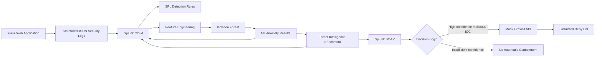
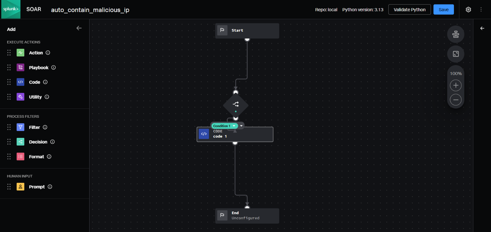
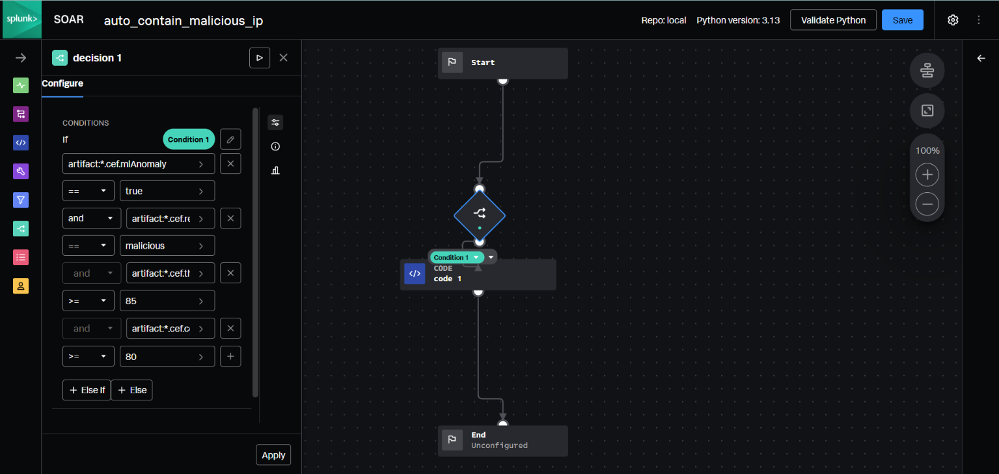
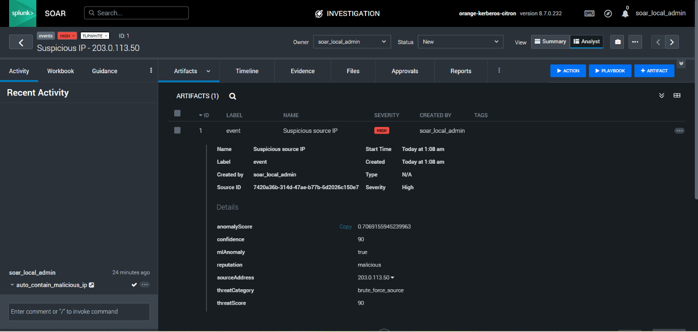
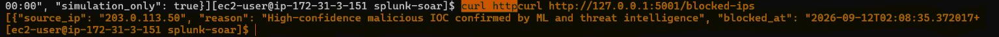

# Security Monitoring & Automated Incident Response with Splunk SOAR

An end-to-end cybersecurity lab demonstrating security telemetry collection, rule-based detection, machine-learning anomaly detection, threat-intelligence enrichment, SOAR orchestration, and simulated automated containment.

The project was originally based on the concept of my BSc group project and was independently rebuilt end-to-end as a clean portfolio implementation.

## Architecture



## Project Workflow

1. A Flask application generates structured security events such as page requests and failed login attempts.
2. Events are sent to Splunk Cloud through the HTTP Event Collector (HEC).
3. SPL detection rules identify suspicious behavior such as repeated failed authentication attempts.
4. A traffic generator creates controlled normal and anomalous traffic using documentation-only IP ranges.
5. Splunk events are aggregated into behavioral features for each source IP.
6. An Isolation Forest model is trained using only normal baseline behavior.
7. Evaluation profiles are scored and ML anomaly results are sent back to Splunk.
8. Anomalous IP addresses are enriched using a simulated threat-intelligence feed.
9. Enriched artifacts are submitted to Splunk SOAR through its REST API.
10. A SOAR playbook evaluates each artifact and performs simulated containment through a mock firewall REST API when the required conditions are met.

## Security Monitoring

Security events contain fields including:

- timestamp
- event type
- source IP
- HTTP method
- request path
- status
- user agent
- simulation run

Example brute-force detection logic:

```spl
index=security_lab event_type="login_attempt" status="failed"
| bin _time span=5m
| stats count by _time source_ip
| where count >= 5
```

The corresponding Splunk alert detects five or more failed login attempts from the same IP address within a five-minute window.

## Machine Learning

The anomaly-detection component uses `IsolationForest` from scikit-learn.

The model is trained only on normal baseline behavior using the following features:

- total requests
- failed login ratio
- admin request ratio
- number of unique paths

The evaluation dataset contains 30 simulated normal profiles and three deliberately injected anomalous profiles:

- repeated failed authentication attempts
- unusually high `/admin` access
- unusually high request volume

A custom anomaly score is derived from the Isolation Forest output, where a higher score represents more unusual behavior.

### Controlled Evaluation Result

In the controlled evaluation dataset:

- **3 of 3** injected anomalous profiles were identified
- **0 of 30** simulated normal profiles were flagged

These results describe only the controlled synthetic evaluation and should not be interpreted as general real-world detection accuracy.

## Threat Intelligence

The anomalous addresses use IANA documentation networks such as:

```text
203.0.113.0/24
```

Because these addresses are not real malicious infrastructure, the project uses an explicitly simulated threat-intelligence feed rather than presenting external reputation results as genuine.

The enrichment stage adds:

- reputation
- threat score
- confidence
- threat category
- threat-intelligence provider

## Splunk SOAR

Splunk SOAR receives enriched anomalous-IP artifacts through its REST API.

The automated playbook evaluates four conditions:

```text
mlAnomaly == true
reputation == malicious
threatScore >= 85
confidence >= 80
```

Only when all conditions are satisfied is automated containment executed.

For the controlled test, the following simulated source IP satisfied the complete containment policy:

```text
203.0.113.50
```

The remaining anomalous profiles did not satisfy the full decision policy and therefore were not automatically blocked.

## Simulated Containment

Containment is implemented using a local mock firewall REST API.

Splunk SOAR sends a block request to:

```text
POST /block
```

The mock firewall records:

- source IP
- reason
- timestamp
- simulation status

Example:

```json
{
  "source_ip": "203.0.113.50",
  "reason": "High-confidence malicious IOC confirmed by ML and threat intelligence",
  "simulation_only": true
}
```

This design demonstrates the automated incident-response workflow without modifying a real production firewall.

## Evidence

### SOAR Playbook



### Automated Decision Logic



### Enriched SOAR Artifact



### Simulated Containment Result



## Project Structure

```text
security-monitoring-splunk-soar/
├── web-app/
│   └── app.py
├── traffic-generator/
│   └── generate_traffic.py
├── ml/
│   ├── data/
│   │   ├── baseline_features.csv
│   │   └── evaluation_features.csv
│   ├── results/
│   │   ├── baseline_scored.csv
│   │   └── evaluation_scored.csv
│   ├── train_isolation_forest.py
│   └── send_results_to_splunk.py
├── threat-intel/
│   ├── lab_ioc_feed.json
│   └── enrich_iocs.py
├── soar/
│   └── send_to_soar.py
├── mock-firewall/
│   └── firewall_api.py
├── screenshots/
│   ├── soar_playbook_overview.png
│   ├── soar_decision_logic.png
│   ├── soar_enriched_artifact.png
│   └── containment_result.png
├── .env.example
├── .gitignore
├── requirements.txt
└── README.md
```

## Installation

Install the required Python dependencies:

```bash
pip install -r requirements.txt
```

Configure the required environment variables before running the integrations.

Required variables:

```text
SPLUNK_HEC_URL
SPLUNK_HEC_TOKEN
SOAR_URL
SOAR_AUTH_TOKEN
```

See `.env.example` for the expected format.

## Running the Lab

### 1. Start the Flask application

```bash
python web-app/app.py
```

### 2. Generate baseline traffic

```bash
python traffic-generator/generate_traffic.py baseline
```

### 3. Generate evaluation traffic

```bash
python traffic-generator/generate_traffic.py evaluation
```

### 4. Train and evaluate the Isolation Forest model

```bash
python ml/train_isolation_forest.py
```

### 5. Send ML results to Splunk

```bash
python ml/send_results_to_splunk.py
```

### 6. Perform threat-intelligence enrichment

```bash
python threat-intel/enrich_iocs.py
```

### 7. Send enriched artifacts to Splunk SOAR

```bash
python soar/send_to_soar.py
```

## Security Notes

- Credentials and API tokens are loaded from environment variables.
- Private keys and `.env` files are excluded through `.gitignore`.
- Synthetic documentation IP ranges are used for traffic simulation.
- Threat-intelligence data in this lab is explicitly simulated.
- Firewall containment is explicitly simulated.
- TLS certificate verification may be disabled in parts of the lab because of trial or self-signed certificates and should not be configured this way in production environments.

## Technologies

- Python
- Flask
- Splunk Cloud
- Splunk SPL
- Splunk HTTP Event Collector
- Splunk SOAR
- REST APIs
- pandas
- scikit-learn
- Isolation Forest
- AWS EC2
- JSON

## Purpose

This project demonstrates how detection engineering, behavioral analytics, threat intelligence, SOAR orchestration, and automated incident response can be integrated into a single security monitoring workflow.

It was designed as a controlled cybersecurity lab and portfolio project rather than a production security platform.